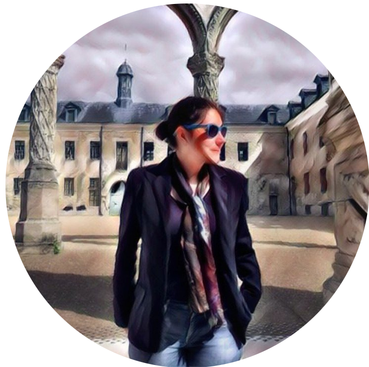

% Clémentine Fourrier 

## Welcome!
 I am a **Ph.D student** (in the [ALMAnaCH team](https://team.inria.fr/almanach/fr/) at [Inria Paris](https://www.inria.fr/centre/paris) working on cognate prediction with neural networks,  
and low-resource neural machine translation architectures.  
I worked as a **software engineer** from 2015 to 2019.

I enjoy programming, and am interested in outreach (mostly towards girls), making science understandable, and delicious food.  

**Research topics**: machine learning, low resource NMT, computational historical linguistics, cognate prediction

### Contact: 
You can reach me at `myfirstname dot mylastname at inria dot fr`, on [Twitter](https://twitter.com/clefourrier), or [LinkedIn](https://www.linkedin.com/in/clefourrier/).

## About this site
This site is deliberately static and lightweight, for ecology, accessibility, and [this](https://jeffhuang.com/designed_to_last/) ([French version](https://framablog.org/2020/08/24/pour-une-page-web-qui-dure-10-ans)).  
I use markdown and pandoc.

# Who am I ?
An engineer at heart.  
My motto would either be: "So much to do, so little time" or "Let me read all the books".

### Education

- 2022 (hopefully): Thèse en informatique pour le TAL - **NLP PhD** (@Inria Paris and @EPHE)
- 2015: Diplôme d'ingénieur - **MEng** (@ENSG-Nancy)
- 2015: Master d'Administration des Entreprises - **MBA** (@ISAM-IAE-Nancy)

### Topics I enjoyed working on 

- using 3D meshes and grids for geology and structural modeling (@Paradigm and @Schlumberger, 2014-2015)
- neurodegenerative disease prediction from longitudinal data (@Brain and Spine Institute, 2017-2018)
- natural language processing, mostly in translation and historical linguistics (@Inria Paris, 2018 - now)

It's likely I'll learn new things again! (robotics maybe? or fluid mechanics? ¯\\_(ツ)_/¯ )

