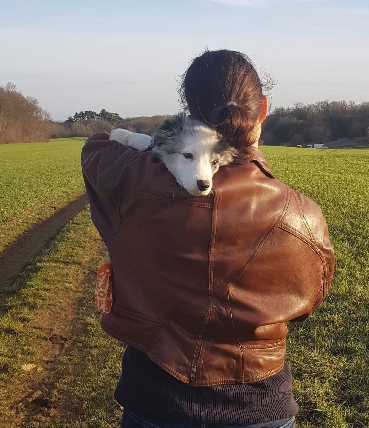

% Clémentine Fourrier

---
toc: true
include-before: |
	

	  
	  <a href="index_fr.html">Qui suis je?</a>
	  <a href="index_fr.html#research">Recherche</a>
	  <a href="index_fr.html#resources">Ressources</a>
	  <a href="index_fr.html#outreach">Vulgarisation</a>
	  <a href="index_fr.html#community">Enseignement/Volontariat</a>
      <a class="nav-right" href="index.html">🇬🇧</a>
	
 

---

# Clémentine Fourrier
## Bienvenue! 
 Je suis en **thèse** (dans l'équipe [ALMAnaCH](https://team.inria.fr/almanach/fr/) à [Inria Paris](https://www.inria.fr/centre/paris)), et je travaille en ce moment sur la prédiction de cognats avec des réseaux de neurones, ainsi que sur des architectures neuronales pour faire de la traduction de langues faiblement dotées.  
J'ai précedemment travaillé comme **ingénieur logiciel** de 2015 à 2019.

Si je ne suis pas ici, je suis en train de programmer ou de lire quelque part.  

### Contact: 
Vous pouvez me contacter à *monprénom point monnom arobase inria point fr*, sur [Twitter](https://twitter.com/clefourrier), ou [LinkedIn](https://www.linkedin.com/in/clefourrier/). 

Si c'est pour de la vulgarisation, n'hésitez surtout pas!
\
\

## A propos de ce site
Ce site a été codé pour être statique et léger, pour des raisons d'écologie, d'accessibilité, et [pour ceci](https://framablog.org/2020/08/24/pour-une-page-web-qui-dure-10-ans).  
J'utilise une combinaison de markdown et pandoc.

# Qui suis-je ? {#who .ref}
Une ingénieure dans l'âme.
Ma devise serait probablement: "Tant de choses passionantes et si peu de temps" ou "Laissez moi lire tous les livres".

### Diplômes

- 2022 (si tout se passe bien): **Thèse en informatique pour le TAL** (@Inria Paris et @EPHE)
- 2015: **Diplôme d'ingénieur** (@ENSG-Nancy)
- 2015: **Master d'Administration des Entreprises** (@ISAM-IAE-Nancy)

### Différents sujets sur lesquels j'ai aimé travailler

- utiliser des maillages surfaciques et volumiques pour faire de la modélisation structurale en géologie (@Paradigm et @Schlumberger, 2014-2015)
- prédire des maladies neurodégénératives à partir de données longitudinales (@Institut du Cerveau et de la Moëlle Epinière, 2017-2018)
- traitement automatiques des langues, principalement en traduction et linguistique historique (@Inria Paris, 2018-maintenant)

Il est très probable que j'apprenne encore de nouvelles choses! Mais quoi? ¯\\_(ツ)_/¯ 

