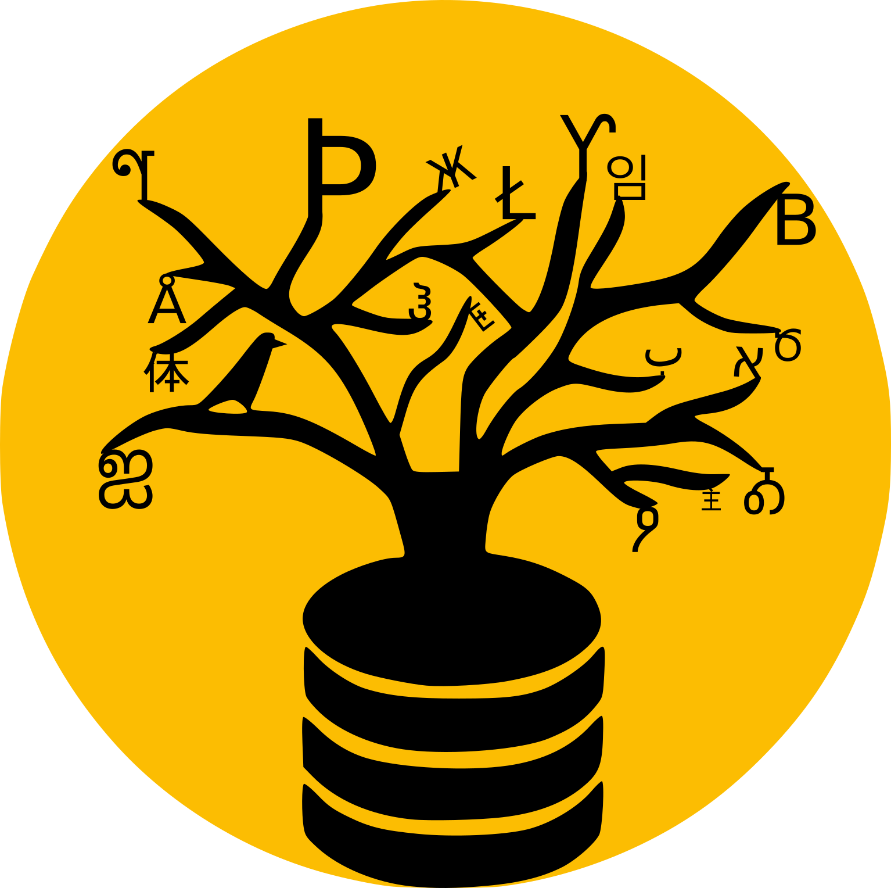

# Recherche {.ref}
**Sujets de recherche**: apprentissage machine, traduction de langues peu dotées, linguistique historique computationnelle, prédiction de cognats

### Mes publications préférées
- [Can Cognate Prediction Be Modelled as a Low-Resource Machine Translation Task?](https://hal.inria.fr/hal-03243380/file/Is_Cognate_Prediction_a_Low_Resource_Machine_Translation_Task__ACL2021Findings-2.pdf) (ACL Findings): nous avons prouvé qu'on peut utiliser des méthodes neurales de traduction automatique pour faire de la prédiction de cognats et explicité comment.
- [Methodological Aspects of Developing and Managing an Etymological Lexical Resource: Introducing EtymDB-2.0](https://hal.inria.fr/hal-02678100/document) (LREC 2020): nous avons présneté une base de données étymologique ainsi qu'une méthodologie pour créer ou gérer la votre!

### Publications
Mes publications complètes sont sur [google scholar](https://scholar.google.com/citations?user=UiK-jPcAAAAJ&hl=en) ou
[hal](https://haltools.inria.fr/Public/afficheRequetePubli.php?auteur_exp=Cl%C3%A9mentine%2C+Fourrier&CB_auteur=oui&CB_titre=oui&CB_article=oui&CB_DOI=oui&langue=Anglais&tri_exp=annee_publi&tri_exp2=typdoc&tri_exp3=date_publi&ordre_aff=TA&CB_rubriqueDiv=oui&Fen=Aff&css=../css/VisuRubriqueEncadre.css).

Ci dessous, une liste widget (n'hésitez pas à faire défiler):

<IFRAME width="100%" height="300" src="https://haltools.archives-ouvertes.fr/Public/afficheRequetePubli.php?auteur_exp=cl%C3%A9mentine%2C+fourrier&annee_publideb=2020&CB_titre=oui&CB_article=oui&langue=Anglais&tri_exp=annee_publi&tri_exp2=typdoc&tri_exp3=date_publi&ordre_aff=TA&Fen=Aff&css=https://clefourrier.github.io/website.css" FRAMEBORDER="1" ></IFRAME>

### Présentations

#### Conférences
- 08/2021: ACL Findings: *Can Cognate Prediction Be Modelled as a Low-Resource Machine Translation Task?* ([Slides](https://d3smihljt9218e.cloudfront.net/lecture/26166/slideshow/4a2b9ebbfc0e00f0b33ea5d69cb949f4.pdf))
- 08/2021: LChange'21 Workshop : *Can Cognate Prediction Be Modelled as a Low-Resource Machine Translation Task?* ([Poster](https://d3smihljt9218e.cloudfront.net/lecture/26166/poster_document/e107a37a833ef9d91fbb3e04ba658928.pdf))
- 05/2020: TALN-RECITAL: *Evolution phonologique des langues et réseaux de neurones* ([Talk](https://videos.univ-lorraine.fr/video.php?id=9730))

#### Séminaires
- 02/2020: Inria, ALMAnaCH seminar: *Learning Sound Correspondences: What about Neural Networks?*

#### Présentations de papiers pour un groupe d'étude du TAL
- 10/2021: *Multilingual Agreement for Multilingual Neural Machine Translation - Yang et al 2021*
- 02/2021: *On the Dangers of Stochastic Parrots: Can Language Models be Too Big - Bender et al 2021* ([Slides](https://drive.google.com/file/d/1q7_KMMTj4dPRD6si9OgIOT-GWujOv-8C/view?usp=sharing))
- 05/2020: *Dataset for Temporal Analysis of English-French Cognates - Frossard et al 2020* ([Slides](https://drive.google.com/file/d/1puLEBVx-KhA28qXdxnJC8KZRTj9rWjep/view?usp=sharing))
- 01/2020: *Universal Adversarial Triggers for Attacking and Analysing NLP - Wallace et al 2019* ([Slides](https://drive.google.com/file/d/1L-dfBzTV7Tsthv6FEOnvOqg4SyFQynan/view?usp=sharing))
- 07/2019: *Identifying and Controlling Important Neurons in NMT, Bau et al 2019* ([Slides](https://drive.google.com/file/d/16OfrE83lA5JA2_ZMuWDqydYiIBcTwlWr/view?usp=sharing))
- 04/2019: *The Potential of Automatic Word Comparision for Historical Linguistics - List et al 2017* ([Slides](https://drive.google.com/file/d/1HFpShYeS2MY1-jiHL9Pd9dbFqWXeZpET/view?usp=sharing))
- 03/2019: *Automatic Inference of Sound Correspondence Patterns Across Multiple Languages - List 2018* ([Slides](https://drive.google.com/file/d/1PRK6MZ5YHxfa4uLnYXFxLXNhamhI4VpM/view?usp=sharing))

# Mes ressources en TAL {#resources .ref}
### Bases de données
#### EtymDB2 - Base de données étymologique, [ici](https://github.com/clefourrier/EtymDB): 
 Base de données étymologique à grain fin, qui différencie entre autres les relations d'héritage, de cognat, d'emprunt, ainsi que différents types de composition.
Elle est fournie avec plusieurs notebooks Jupyter pour simplifier l'analyse des données, notamment un pour tracer vos propres arbres phylogénétiques à partir de relations linguistiques. (Perl, Jupyter notebooks)  
Détails dans notre [papier LREC](http://www.lrec-conf.org/proceedings/lrec2020/pdf/2020.lrec-1.392.pdf): *Methodological Aspects of Developing and Managing an Etymological Lexical Resource: Introducing EtymDB 2.0.* 

  

### Logiciels
#### PLexGen - Générateur de langues artificielles, [here](https://github.com/clefourrier/PLexGen):
Si vous voulez essayer la génération de langues artificielles (conlang), vous pouvez essayer avec PLexGen, mon générateur de lexiques et de changements phonétiques!  
Fournissez les spécifications de votre langue (phonétiques, et phontactiques) ainsi que les changements phonétiques associés, et il génèrera aléatoirement une proto-langue et ses langues filles! (Python)

#### CopperMT - Cognate Prediction Per Machine Translation, [here](https://github.com/clefourrier/CopperMT):
Scripts et algorithmes pour lancer des tâches de prédiction de cognat à l'aide de méthodes de traduction automatique (statistiques, en appelant MOSES, ou neurales avec mon code multi-encodeur multi-décodeur basé sur fairseq).
Détails dans notre [papier ACL Findings](): *Is Cognate Prediction a Machine Translation Task?* 

