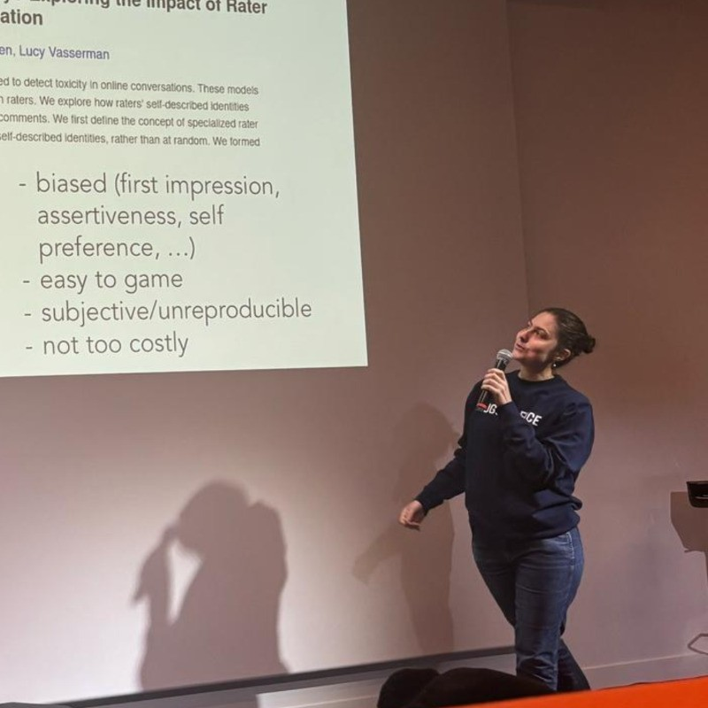

% Clémentine Fourrier

---
toc: true
include-before: |
	

	  
	  <a href="index.html#who">Who am I?</a>
	  <a href="index.html#research">Research</a>
	  <a href="index.html#resources">Resources</a>
	
 
---

## Welcome!
 My name is Clémentine, and I'm an AI researcher at HuggingFace. I lead our evaluation efforts (for LLM and agents). My team and I maintain `ligtheval`, a lightweight evaluation suite, `the evaluation guidebook` (good practices on evaluation), and help the community build their own evaluations. 

We previously worked on the Open LLM Leaderboard (11K open source models evaluated over 2 years).

Before Hugging Face, I did a **PhD** on using neural networks to reconstruct dead and disappeared words (from 2019 to 2022), after working as a **software engineer** (from 2015 to 2019).

I enjoy programming, and am interested in making science open and understandable, books, and delicious food. I go by `clefourrier` over the web.

### Contact: 
You can reach me at `myfirstname at 🤗 dot co`, on [Twitter](https://twitter.com/clefourrier), or [LinkedIn](https://www.linkedin.com/in/clefourrier/).

### About this site
This site is deliberately static and lightweight, for ecology, accessibility, and [this](https://jeffhuang.com/designed_to_last/) ([French version](https://framablog.org/2020/08/24/pour-une-page-web-qui-dure-10-ans)).  
I use markdown and pandoc.

## Who am I ? {#who}
An engineer at heart. 
My motto would likely be: "So much to do, so little time".

### Education

- 2022: **CS PhD** (@Inria Paris and @EPHE)
- 2015: **MEng** (@ENSG-Nancy) and **MBA** (@ISAM-IAE-Nancy) *(don't reproduce this at home I was dead tired)*

### Topics I enjoyed working on 

- using 3D meshes and grids for geology and structural modeling (2014-2015)
- neurodegenerative disease prediction from longitudinal data (2017-2018)
- natural language processing applied to historical linguistics (2018-2022)
- graph machine learning (2022)
and of course, evaluation/agents, my current topics of interest!

It's likely I'll learn new things again! (robotics maybe? ¯\\_(ツ)_/¯ )

## Research 

### Featured publications
As a main author:

- 2024, ICLR: [GAIA: a benchmark for General AI Assistants](https://openreview.net/forum?id=fibxvahvs3)
- 2022, PhD manuscript: [Neural Approaches to Historical Word Reconstruction](https://theses.hal.science/tel-04505549/)
- 2022, ACL: [Probing Multilingual Cognate Prediction Models](https://aclanthology.org/2022.findings-acl.299/)
- 2021, ACL: [Can Cognate Prediction Be Modelled as a Low-Resource Machine Translation Task?](https://aclanthology.org/2021.findings-acl.75/)

As a contributor:

- 2024, arxiv: [Global MMLU: Understanding and Addressing Cultural and Linguistic Biases in Multilingual Evaluation](https://arxiv.org/abs/2412.03304)
- 2023, arxiv: [Zephyr: Direct Distillation of LM Alignment](https://arxiv.org/abs/2310.16944)
- 2022, arxiv: [Bloom: A 176b-parameter open-access multilingual language model](https://arxiv.org/abs/2211.05100)
- 2020, arxiv: [The Alzheimer's Disease Prediction Of Longitudinal Evolution (TADPOLE) Challenge: Results after 1 Year Follow-up](https://arxiv.org/abs/2002.03419)

You'll find my full publication list on google scholar.

### Talks/blogs/press
- Mar 2025: Talk - [CNRS NLP WG: Panorama of LLM evaluations](slides)
- Mar 2025: Blog - [Fixing the Open LLM Leaderboard with Math-Verify](https://huggingface.co/blog/math_verify_leaderboard) - introduction of a better math parser for math evaluations (work mainly done by Hynek Kydlicek)
- Feb 2025: TV - [France24's tech TV Show: Tech24](https://www.youtube.com/watch?v=snPH-zZRSNQ)
- Feb 2025: Elysée communication - [AI summit conclusions](https://www.elysee.fr/emmanuel-macron/2025/02/11/les-actions-de-paris-pour-lintelligence-artificielle), showcasing the French LLM Leaderboard we did with French institutions
- Jan 2025: Blog - [CO2 emissions and model performance: Insights from the Open LLM Leaderboard](https://huggingface.co/blog/leaderboard-emissions-analysis) - in depth analysis of performance vs CO2 cost of models
- Jul 2024: Press - [The Economist: How to tell which AI model is best](https://www.economist.com/science-and-technology/2024/07/31/gpt-claude-llama-how-to-tell-which-ai-model-is-best)
- Jul 2024: Podcast - [Latent Space Podcast: Benchmarks 201](https://www.latent.space/p/benchmarks-201)
- Jun 2024: Press - [VentureBeat: Hugging Face’s updated leaderboard shakes up the AI evaluation game](https://venturebeat.com/ai/hugging-faces-updated-leaderboard-shakes-up-the-ai-evaluation-game/)
- Jun 2024: Press - [La Tribune: Pour contrer la crise de l'évaluation des IA, Hugging Face rehausse les exigences](https://www.latribune.fr/technos-medias/informatique/pour-contrer-la-crise-de-l-evaluation-des-ia-hugging-face-rehausse-les-exigences-1000836.html)
- Jun 2024: Blog - [Performances are plateauing, let's make the leaderboard steep again](https://huggingface.co/spaces/open-llm-leaderboard/blog)
- May 2024: Blog - [Let's talk about LLM evaluation](https://huggingface.co/blog/clefourrier/llm-evaluation) - position blog about what evaluations are for
- May 2024: Event - Invitation to the gathering of "France's top AI talents" at the Elysée  
- Apr 2024: Press - [La Recherche: 2023, l'année des grands modèles de langue ouverts](https://www.larecherche.fr/intelligence-artificielle/2023-lann%C3%A9e-des-grands-mod%C3%A8les-de-langue-ouverts)
- Apr 2024: Press - [Hugging Face releases a benchmark for testing generative AI on health tasks](https://techcrunch.com/2024/04/18/hugging-face-releases-a-benchmark-for-testing-generative-ai-on-health-tasks/)
- Dec 2023: Blog - [2023, year of Open LLMs](https://huggingface.co/blog/2023-in-llms) 
- Dec 2023: Blog - [Open LLM Leaderboard: DROP deep dive](https://huggingface.co/blog/open-llm-leaderboard-drop) - analysis of the problems in the original DROP implementation 
- June 2023: Blog - [What's going on with the Open LLM Leaderboard?](https://huggingface.co/blog/open-llm-leaderboard-mmlu) - on the many ways to evaluate MMLU
- Mar 2023: Podcast - [Parlons Tech: l'IA générative à la Loupe](https://soundcloud.com/orangehellofuture/parlons-tech-1-ia-generative-ethique-biais-algorithmiques-droits-auteurs)
- Jan 2023: Blog - [Introduction to Graph Machine Learning](https://huggingface.co/blog/intro-graphml)

## Resources {#resources}

#### Lighteval ([here](https://github.com/huggingface/lighteval))
Lightweight evaluation library for LLMs. Easy to use and contains most SOTA datasets!

#### Open LLM Leaderboard ([v2](https://huggingface.co/spaces/open-llm-leaderboard/open_llm_leaderboard#/) and [v1](https://huggingface.co/spaces/open-llm-leaderboard-old/open_llm_leaderboard))
World wide rankings and evaluation of Open Source LLMs, maintained by my team and I, from 2023 to 2025. 11K models were evaluated. The repositories and datasets are kept for archival purposes

#### Evaluation guidebook ([here](https://github.com/huggingface/evaluation-guidebook))
Anything you need to know about LLM evaluations. Contains both starter resources and advanced troubleshooting.

#### PLexGen ([here](https://github.com/clefourrier/PLexGen))
Conlang generator. This one dates back from my PhD, it's a phonetic lexicon generator and sound change applier! Provide your language shape (phonetics and phonotactics) and sound changes, and it will randomly generate a proto-language and its daughter languages after your specifications!
